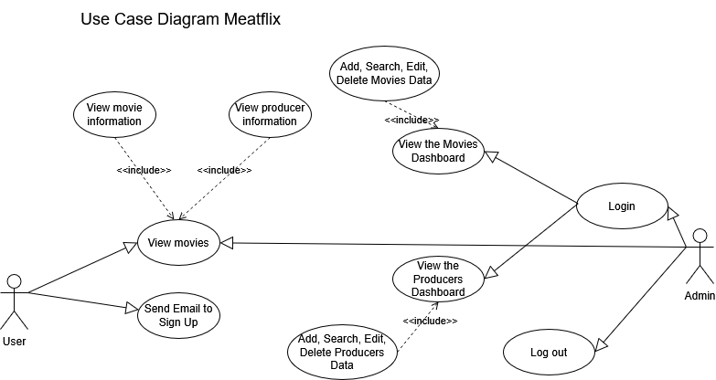

# 🍖 MeatFLIX.id here baby

MeatFLIX.id is a parody website of [netflix.com](netflix.com), this contains code that I made for my internship practice built using laravel and tailwind.


## 📥 How to install

1. Clone my repositories with link below

```bash
git clone https://github.com/azir999/meatflix
```
2. Install composer

```bash
composer install
```

3. Migration my database and seeder
```bash
php artisan migrate --seed
```
4. Clone env

```bash
cp .env.example .env
```

5. Get key

```bash
php artisan key:generate
```

6. Run css

```bash
npm install
npm run dev
```

7. Run website

```bash
php artisan serve
```

## 🔑 Login
Email:
```bash
admin@example.com
```
Password:
```bash
password
```

# 💫 About Me:
Never make a decision in a state of anger, and never make a promise in a state of excitement.<br><br>-Ali bin Abi Thalib


## 🌐 Socials:
[](https://discord.gg/8DNS9dmM) [](https://instagram.com/m.azir_) [](mailto:Muhammadazir188@gmail.com) 

## 💻 Tech Stack:
     
## 📊 GitHub Stats:


[](https://visitcount.itsvg.in)


# ⚒️ Use Case Diagram 



# 📚 Class Diagram 


# 🏃🏻 Activity Diagram


